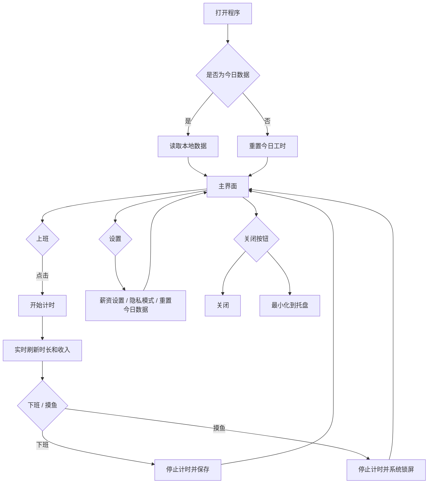

# 赛博牛马薪资计算器

一个轻量桌面薪资计时小工具，用来记录今日工作时长，并根据底薪、绩效、奖金、加班费自动估算今日收入。

## 当前状态

初步可用版。当前功能以稳定记录工时、计算收入、隐私遮罩、桌面悬浮窗口为主。

## 灵感来源

- “赛博牛马”相关桌面陪伴/打工人小工具概念
- B 站视频：[开始上班-哔哩哔哩](https://b23.tv/3OuEdlW)

## 主要功能

- 上班 / 下班计时
- 今日工作时长实时显示
- 今日收入实时估算
- 薪资设置：工作时间、底薪、加班费/h、绩效、奖金
- 超过设定工作时间后，超出部分按加班费/h 计算
- 加班费为 0 时，超过设定下班时间后的收入不再增长
- 隐私模式：薪资相关信息非明文显示
- 摸鱼按钮：停止计时并调用 Windows 系统锁屏
- 自由缩放窗口：拖动窗口边缘即可调整大小
- 最小化到系统托盘：托盘图标可恢复窗口或退出
- 重置今日数据：清空今日计时，保留薪资配置

## 普通用户使用

普通用户不需要安装 Node.js，也不需要运行开发命令。

1. 打开 GitHub Release 页面
2. 下载 `CyberCowSalaryCalculator.zip`
3. 解压压缩包
4. 运行 `CyberCowSalaryCalculator.exe`

发布包说明见 [RELEASE.md](./RELEASE.md)。

## 开发者使用

如果你想基于源码继续开发、调试或自己打包，请先安装依赖：

```powershell
npm.cmd install
```

开发运行：

```powershell
npm.cmd run dev
```

打包生成 Windows 便携版：

```powershell
npm.cmd run dist
```

构建产物目录（如 `dist/`、`publish/`、`manual-release/`）不会进入 Git 仓库，需要在本机打包生成。

## 数据说明

数据保存在 Electron/Chromium 的 `localStorage` 中。关闭程序或清除进程不会删除已保存配置。

发布版第一次启动时会执行一次初始化清理，移除同一应用 ID 下可能遗留的开发/测试数据，避免测试薪资配置进入正式使用状态。初始化完成后会写入标记，后续正常使用不会重复清空数据。

会保存的数据：

- 今日累计工作时长
- 当前是否正在计时
- 薪资配置
- 隐私模式状态

跨天打开时，今日工时会自动重置。

## 窗口与退出

- 长按界面空白区域可拖动窗口
- 拖动窗口边缘可自由缩放
- 点击右上角 `X` 会出现关闭选项：
  - `关闭`：退出并清除当前进程
  - `最小化`：隐藏到后台并显示系统托盘图标
- 最小化后可通过系统托盘图标恢复窗口

## 核心计算

```text
每日设定工作时长 = 下班时间 - 上班时间
月标准工时 = 每日设定工作时长 * 21.75
自动折算时薪 = (底薪 + 绩效 + 奖金) / 月标准工时
正常收入 = min(今日工作时长, 每日设定工作时长) * 自动折算时薪
加班收入 = max(0, 今日工作时长 - 每日设定工作时长) * 加班费/h
今日收入 = 正常收入 + 加班收入
```

当加班费/h 为 `0` 时，系统会把设定下班时间后的继续计时视为免费加班：工作时长仍继续记录，但今日收入停止增长。

`21.75` 是常见月计薪天数，后续可改为可配置项。

## 功能流程


